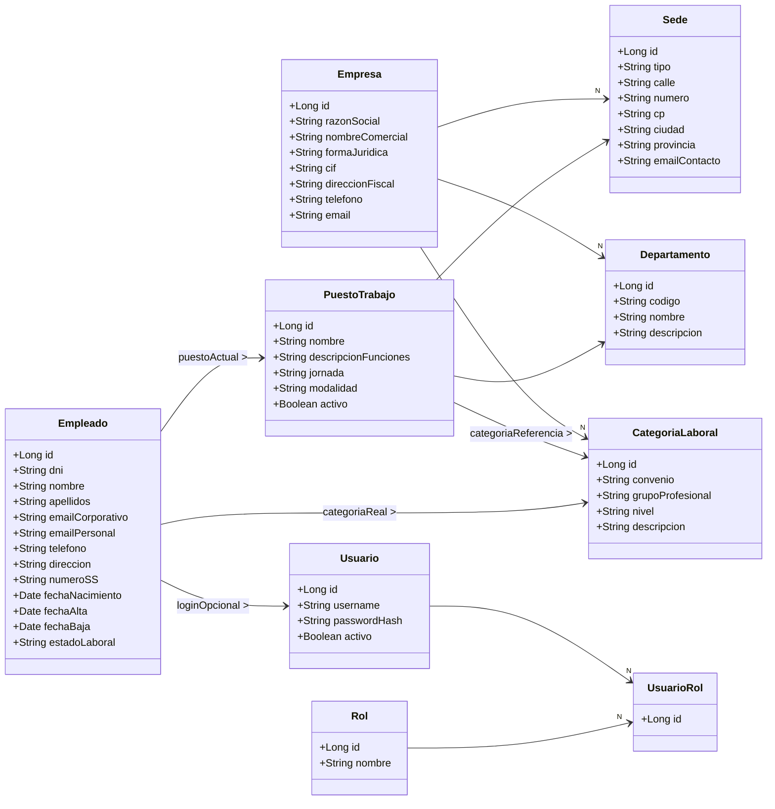

```sql
/* ==========================================================

   BORRADO PREVIO EN ORDEN SEGURO

   ========================================================== */

DROP TABLE IF EXISTS usuario_rol;

DROP TABLE IF EXISTS usuario;

DROP TABLE IF EXISTS rol;

DROP TABLE IF EXISTS empleado;

DROP TABLE IF EXISTS puesto_trabajo;

DROP TABLE IF EXISTS categoria_laboral;

DROP TABLE IF EXISTS departamento;

DROP TABLE IF EXISTS sede;

DROP TABLE IF EXISTS empresa;

  

/* ==========================================================

   CREACIÓN DE TABLAS PRINCIPALES

   ========================================================== */

  

CREATE TABLE empresa (

    id BIGINT AUTO_INCREMENT PRIMARY KEY,

    razon_social VARCHAR(255) NOT NULL,

    nombre_comercial VARCHAR(255),

    forma_juridica VARCHAR(100),

    cif VARCHAR(20) UNIQUE NOT NULL,

    direccion_fiscal VARCHAR(255),

    telefono VARCHAR(50),

    email VARCHAR(100)

);

  

CREATE TABLE sede (

    id BIGINT AUTO_INCREMENT PRIMARY KEY,

    empresa_id BIGINT NOT NULL,

    tipo VARCHAR(50),

    calle VARCHAR(255),

    numero VARCHAR(20),

    cp VARCHAR(10),

    ciudad VARCHAR(100),

    provincia VARCHAR(100),

    email_contacto VARCHAR(100),

    FOREIGN KEY (empresa_id) REFERENCES empresa(id)

);

  

CREATE TABLE departamento (

    id BIGINT AUTO_INCREMENT PRIMARY KEY,

    empresa_id BIGINT NOT NULL,

    codigo VARCHAR(20),

    nombre VARCHAR(100),

    descripcion TEXT,

    FOREIGN KEY (empresa_id) REFERENCES empresa(id)

);

  

CREATE TABLE categoria_laboral (

    id BIGINT AUTO_INCREMENT PRIMARY KEY,

    empresa_id BIGINT NOT NULL,

    convenio VARCHAR(100),

    grupo_profesional VARCHAR(100),

    nivel VARCHAR(50),

    descripcion TEXT,

    FOREIGN KEY (empresa_id) REFERENCES empresa(id)

);

  

CREATE TABLE puesto_trabajo (

    id BIGINT AUTO_INCREMENT PRIMARY KEY,

    sede_id BIGINT NOT NULL,

    departamento_id BIGINT NOT NULL,

    categoria_referencia BIGINT NOT NULL,

    nombre VARCHAR(100),

    descripcion_funciones TEXT,

    jornada VARCHAR(50),

    modalidad VARCHAR(50),

    activo BOOLEAN DEFAULT TRUE,

    FOREIGN KEY (sede_id) REFERENCES sede(id),

    FOREIGN KEY (departamento_id) REFERENCES departamento(id),

    FOREIGN KEY (categoria_referencia) REFERENCES categoria_laboral(id)

);

  

CREATE TABLE empleado (

    id BIGINT AUTO_INCREMENT PRIMARY KEY,

    puesto_actual BIGINT,

    categoria_real BIGINT,

    dni VARCHAR(20) UNIQUE NOT NULL,

    nombre VARCHAR(100) NOT NULL,

    apellidos VARCHAR(150),

    email_corporativo VARCHAR(100) UNIQUE,

    email_personal VARCHAR(100),

    telefono VARCHAR(50),

    direccion VARCHAR(255),

    numero_ss VARCHAR(20),

    fecha_nacimiento DATE,

    fecha_alta DATE,

    fecha_baja DATE,

    estado_laboral VARCHAR(50),

    FOREIGN KEY (puesto_actual) REFERENCES puesto_trabajo(id),

    FOREIGN KEY (categoria_real) REFERENCES categoria_laboral(id)

);

  

/* ==========================================================

   SEGURIDAD INTEGRADA (usuario, rol, usuario_rol)

   ========================================================== */

  

CREATE TABLE usuario (

    id BIGINT AUTO_INCREMENT PRIMARY KEY,

    empleado_id BIGINT,

    username VARCHAR(100) UNIQUE NOT NULL,

    password_hash VARCHAR(255) NOT NULL,

    activo BOOLEAN DEFAULT TRUE,

    FOREIGN KEY (empleado_id) REFERENCES empleado(id)

);

  

CREATE TABLE rol (

    id BIGINT AUTO_INCREMENT PRIMARY KEY,

    nombre VARCHAR(50) UNIQUE NOT NULL

);

  

CREATE TABLE usuario_rol (

    id BIGINT AUTO_INCREMENT PRIMARY KEY,

    usuario_id BIGINT NOT NULL,

    rol_id BIGINT NOT NULL,

    FOREIGN KEY (usuario_id) REFERENCES usuario(id),

    FOREIGN KEY (rol_id) REFERENCES rol(id)

);

  

/* ==========================================================

   INSERTS DE EMPRESA, SEDE, DEPARTAMENTOS

   ========================================================== */

  

INSERT INTO empresa

(razon_social, nombre_comercial, forma_juridica, cif, direccion_fiscal, telefono, email)

VALUES

('Desarrollos Software Iberia S.L.', 'DSI Tech', 'S.L.', 'B12345678',

'C/ Innovación 22, Valencia', '963112233', 'contacto@dsitech.com');

  

INSERT INTO sede

(empresa_id, tipo, calle, numero, cp, ciudad, provincia, email_contacto)

VALUES

(1, 'Central', 'C/ Innovación', '22', '46001', 'Valencia', 'Valencia', 'central@dsitech.com');

  

INSERT INTO departamento (empresa_id, codigo, nombre, descripcion) VALUES

(1, 'DIR', 'Dirección', 'Dirección ejecutiva'),

(1, 'DEV', 'Desarrollo', 'Backend, frontend, fullstack'),

(1, 'QA', 'Calidad', 'Testing y automatización'),

(1, 'IT', 'Sistemas', 'Infraestructura y redes'),

(1, 'HR', 'Recursos Humanos', 'Gestión de personas'),

(1, 'PM', 'Proyectos', 'Product owners y PMs');

  

/* ==========================================================

   INSERTS DE CATEGORÍAS LABORALES

   ========================================================== */

  

INSERT INTO categoria_laboral

(empresa_id, convenio, grupo_profesional, nivel, descripcion) VALUES

(1, 'Convenio TIC', 'Programador Junior', 'I', 'Nivel inicial'),

(1, 'Convenio TIC', 'Programador Senior', 'II', 'Nivel avanzado'),

(1, 'Convenio TIC', 'Arquitectura', 'III', 'Alta especialización'),

(1, 'Convenio TIC', 'Manager', 'IV', 'Dirección de equipos'),

(1, 'Convenio TIC', 'Alta Dirección', 'V', 'Dirección ejecutiva'),

(1, 'Convenio TIC', 'Alta Dirección', 'VI', 'Dirección técnica');

  

/* ==========================================================

   INSERTS DE PUESTOS COMPLETOS

   ========================================================== */

  

INSERT INTO puesto_trabajo

(sede_id, departamento_id, categoria_referencia, nombre, descripcion_funciones, jornada, modalidad, activo)

VALUES

-- Dirección

(1, 1, 5, 'CEO - Director General', 'Estrategia y dirección global.', 'Completa', 'Presencial', TRUE),

(1, 1, 6, 'CTO - Director Técnico', 'Liderazgo técnico.', 'Completa', 'Híbrido', TRUE),

-- Proyectos

(1, 6, 4, 'Head of Product / Product Owner', 'Gestión del producto.', 'Completa', 'Híbrido', TRUE),

-- RRHH

(1, 5, 4, 'Director de RRHH', 'Gestión de personal y cultura.', 'Completa', 'Presencial', TRUE),

-- Desarrollo

(1, 2, 1, 'Programador Junior', 'Desarrollo básico.', 'Completa', 'Híbrido', TRUE),

(1, 2, 2, 'Programador Senior', 'Desarrollo avanzado.', 'Completa', 'Remoto', TRUE),

(1, 2, 3, 'Arquitecto Software', 'Diseño de arquitectura.', 'Completa', 'Presencial', TRUE),

-- QA

(1, 3, 2, 'QA Tester', 'Testing y calidad.', 'Completa', 'Híbrido', TRUE);

  

/* ==========================================================

   INSERTS DE EMPLEADOS REALISTAS

   ========================================================== */

  

INSERT INTO empleado

(puesto_actual, categoria_real, dni, nombre, apellidos, email_corporativo,

telefono, direccion, numero_ss, fecha_nacimiento, fecha_alta, estado_laboral)

VALUES

((SELECT id FROM puesto_trabajo WHERE nombre='CEO - Director General'), 5,

'12345678A', 'Laura', 'Martínez Ruiz', 'laura.m@dsitech.com',

'611223344', 'C/ Alameda 12', '12345678901',

'1980-01-10', '2020-03-01', 'Activo'),

  

((SELECT id FROM puesto_trabajo WHERE nombre='CTO - Director Técnico'), 6,

'98765432Z', 'Miguel', 'Serrano Piquer', 'miguel.cto@dsitech.com',

'644112233', 'C/ Artesanos 77', '90345678901',

'1982-03-19', '2021-05-02', 'Activo'),

  

((SELECT id FROM puesto_trabajo WHERE nombre='Head of Product / Product Owner'), 4,

'87654321Y', 'Paula', 'Doménech Rivas', 'paula.product@dsitech.com',

'699887766', 'C/ Barques 14', '80345678901',

'1990-10-11', '2022-06-15', 'Activo'),

  

((SELECT id FROM puesto_trabajo WHERE nombre='Director de RRHH'), 4,

'76543210X', 'David', 'Aguilar Torres', 'david.hr@dsitech.com',

'611990088', 'C/ Remei 4', '70345678901',

'1987-04-12', '2021-09-01', 'Activo'),

  

((SELECT id FROM puesto_trabajo WHERE nombre='Programador Senior'), 2,

'34567890C', 'Ana', 'Torres Díaz', 'ana.t@dsitech.com',

'633445566', 'C/ Música 5', '32345678901',

'1996-07-15', '2022-01-10', 'Activo'),

  

((SELECT id FROM puesto_trabajo WHERE nombre='Programador Junior'), 1,

'45678901D', 'Javier', 'Rodríguez Pérez', 'javier.r@dsitech.com',

'644556677', 'C/ Mar 33', '42345678901',

'1999-09-21', '2023-04-01', 'Activo'),

  

((SELECT id FROM puesto_trabajo WHERE nombre='QA Tester'), 2,

'56789012E', 'Clara', 'Santos Vives', 'clara.s@dsitech.com',

'655667788', 'C/ Pinedo 88', '52345678901',

'1992-03-02', '2022-09-01', 'Activo');

  

/* ==========================================================

   INSERTS DE ROLES, USUARIOS Y PERMISOS

   ========================================================== */

  

INSERT INTO rol (nombre) VALUES ('ADMIN'), ('JEFE'), ('RRHH'), ('USER');

  

INSERT INTO usuario (empleado_id, username, password_hash, activo) VALUES

((SELECT id FROM empleado WHERE email_corporativo='laura.m@dsitech.com'),

'laura.ceo', 'HASH_CEO', TRUE),

((SELECT id FROM empleado WHERE email_corporativo='miguel.cto@dsitech.com'),

'miguel.cto', 'HASH_CTO', TRUE),

((SELECT id FROM empleado WHERE email_corporativo='david.hr@dsitech.com'),

'david.hr', 'HASH_RRHH', TRUE);

  

INSERT INTO usuario_rol (usuario_id, rol_id) VALUES

((SELECT id FROM usuario WHERE username='laura.ceo'), (SELECT id FROM rol WHERE nombre='ADMIN')),

((SELECT id FROM usuario WHERE username='laura.ceo'), (SELECT id FROM rol WHERE nombre='JEFE')),

((SELECT id FROM usuario WHERE username='miguel.cto'), (SELECT id FROM rol WHERE nombre='JEFE')),

((SELECT id FROM usuario WHERE username='miguel.cto'), (SELECT id FROM rol WHERE nombre='USER')),

((SELECT id FROM usuario WHERE username='david.hr'), (SELECT id FROM rol WHERE nombre='RRHH'));
```